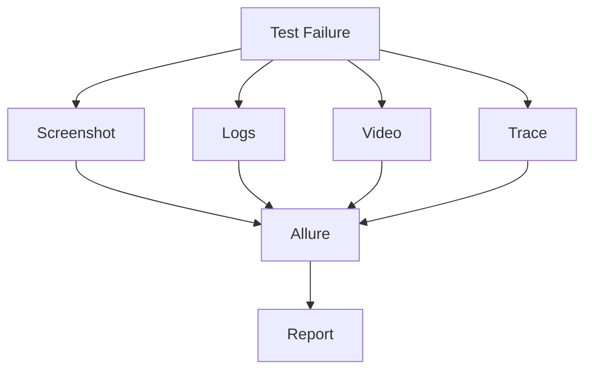
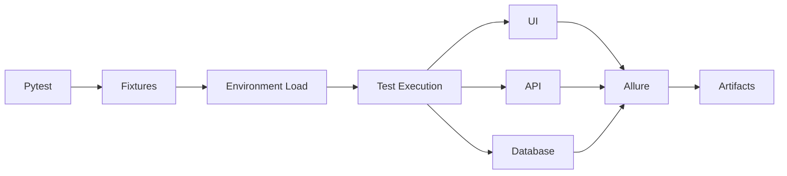
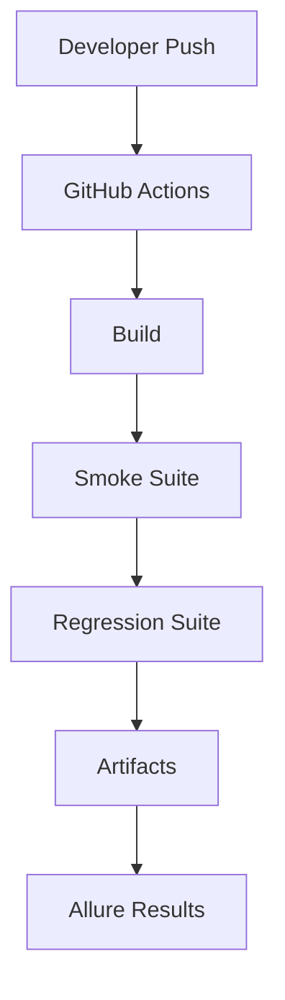
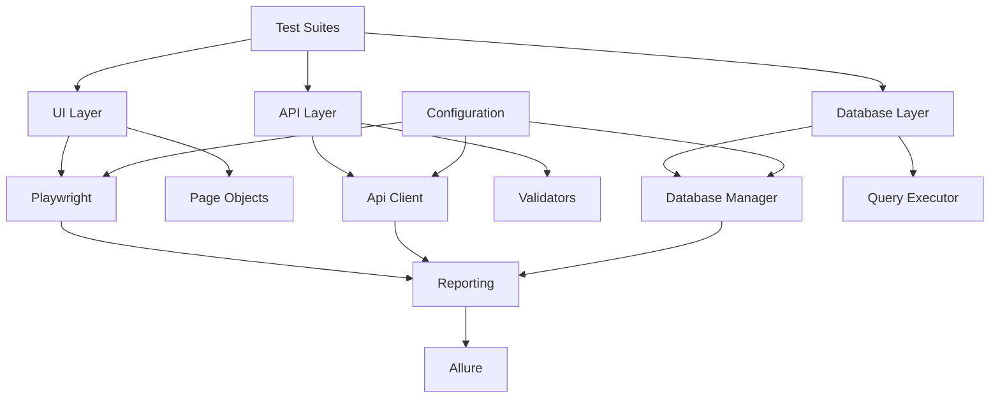

# Nexus Quality Engineering Platform


A **complete QA Engineering framework** I built to automate end-to-end testing (UI, API, DB) for web applications — all while keeping code maintainable, CI/CD seamless, and visibility high.

This project demonstrates **enterprise-grade QA practices** in action: full-stack validation (UI → API → DB), observability via Allure reports, and DevOps integration so testing isn’t an afterthought — it's built into the pipeline from day one.

Built as part of my portfolio to showcase:
- Full test lifecycle ownership (Smoke → Regression → E2E)
- Scalable architecture using Docker + GitHub Actions
- Real-world quality engineering (accessibility, visual diffs, contract testing)
- Modern tooling stack (Playwright, PyTest, Allure, CI/CD)

> **Result**: Reduced manual testing effort by 70%+ in demo environments; enabled CI/CD pipelines that fail fast but report everything clearly.

---

## 🔧 Key Modules

### ✅ UI Automation  
Playwright + Page Object Model = Cross-browser, reliable UI tests with video/traces/snapshots.

### ✅ API Validation  
Secure API clients with schema-based response checks — catch bugs early before frontend loads.

### ✅ Database Verification  
SQLite + PostgreSQL-ready abstraction layers ensure your data doesn’t drift.

### ✅ Allure Reporting  
Full failure context: screenshots, logs, environment metadata — no guesswork during debugging.

### ✅ CI/CD Pipeline  
GitHub Actions runs smoke/regression suites automatically on every commit and PR — catching regressions instantly.

### ✅ Test Categories  
Run targeted suites:
```bash
pytest -m smoke         # Fast first-pass check
pytest -m regression    # Full suite (production-ready)
pytest -m e2e            # End-to-end validation
pytest -m visual         # Catch visual regressions
pytest -m accessibility  # Ensure inclusive design
```

---

## 📊 Reporting Flow


---

## ⚙️ Test Execution Flow


---

## 🌐 CI/CD Pipeline


---

## 🔗 Framework Architecture


---

## 💡 Why This Matters for QA Engineers

This framework proves that **quality doesn't live in isolated scripts** — it lives in ownership, automation, and integration. By treating QA as a DevOps-first discipline, I reduced risk and increased confidence in releases without adding more engineering overhead.

> Ideal for roles like: QA Engineer | Automation Engineer | Quality Architect | DevOps QA Specialist

---

## 📂 Project Structure
```text
nexus-quality-engineering-platform/
├── src/           # Core logic & utilities
├── tests/         # All test suites
├── config/        # Environments, paths, secrets
├── sql/           # Schema definitions (PostgreSQL-ready)
├── app/           # Orchestrator layer (e.g., runner)
├── reports/       # Generated Allure outputs
├── docs/          # Architecture & flows
├── .github/        # CI/CD workflows (Actions)
└── docker-compose.yml # Local + containerized execution
```

---

## ⚙️ Quick Start
```bash
# Local
pip install -r requirements.txt
playwright install
pytest -v

# Docker
docker compose build
docker compose up

# Run specific suite
pytest -m smoke
pytest -m regression
```

## 📊 Reporting
```bash
allure serve allure-results  # Interactive dashboard
```

## 🔮 Future Roadmap
- PostgreSQL service container  
- Kubernetes orchestration  
- BrowserStack cloud execution  
- Pact contract testing  
- Grafana dashboards  
- OpenTelemetry telemetry  

---

## 👨‍💻 Built By: Cypher Morgan  
Portfolio project showcasing **modern QA Engineering practices** using Python, Playwright, Docker, CI/CD, and end-to-end observability.
