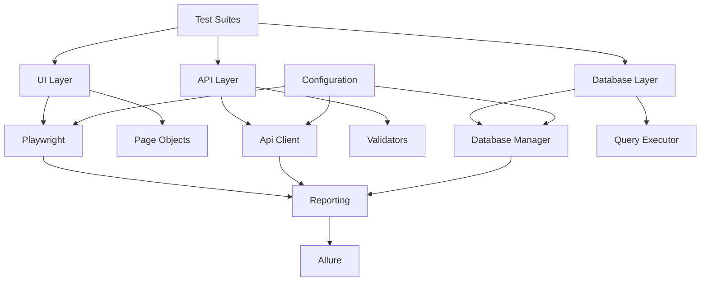

# Framework Architecture

```mermaid
graph TD

A[Test Suites]

A --> B[UI Layer]
A --> C[API Layer]
A --> D[Database Layer]

B --> E[Playwright]
B --> F[Page Objects]

C --> G[Api Client]
C --> H[Validators]

D --> I[Database Manager]
D --> J[Query Executor]

E --> K[Reporting]
G --> K
I --> K

K --> L[Allure]

M[Configuration]
M --> E
M --> G
M --> I
```
