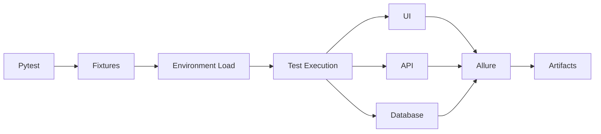

# Test Execution Flow

```mermaid
graph LR

A[Pytest]

A --> B[Fixtures]

B --> C[Environment Load]

C --> D[Test Execution]

D --> E[UI]
D --> F[API]
D --> G[Database]

E --> H[Allure]
F --> H
G --> H

H --> I[Artifacts]
```
